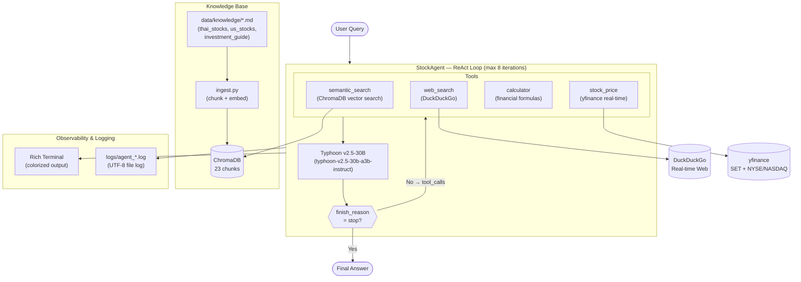

# Architecture Diagram — Agentic RAG Stock Assistant

## System Architecture (Mermaid)



---

## Data Flow

```
1. User types query
       │
2. Agent sends to Typhoon LLM with 4 tool definitions
       │
3. LLM returns tool_calls (ReAct: think → act)
       │
4. Agent executes tool(s):
   ├─ semantic_search  → embed query → cosine search ChromaDB → top-k docs + scores
   ├─ web_search       → DuckDuckGo DDGS → title + body + URL
   ├─ calculator       → restricted eval() → numeric result
   └─ stock_price      → yfinance Ticker → price, P/E, sector, mktcap
       │
5. Tool results appended to messages as role="tool"
       │
6. LLM synthesizes results → next iteration or final answer
       │
7. Return Thai-language answer + full log
```

---

## Tech Stack Summary (for slides)

| Layer | Technology | Detail |
|---|---|---|
| LLM | Typhoon API | v2.5-30B-A3B, open-source, ≤50B |
| Agent Pattern | ReAct | Reasoning + Acting loop |
| Vector DB | ChromaDB | Persistent local storage |
| Embedding | Sentence Transformers | `paraphrase-multilingual-MiniLM-L12-v2` |
| Real-time | yfinance | SET (`.BK`) + US stocks |
| Web Search | DuckDuckGo DDGS | No API key required |
| UI | Rich | Terminal panels + colorized logs |
| Language | Python 3.12 | Windows 11 |
